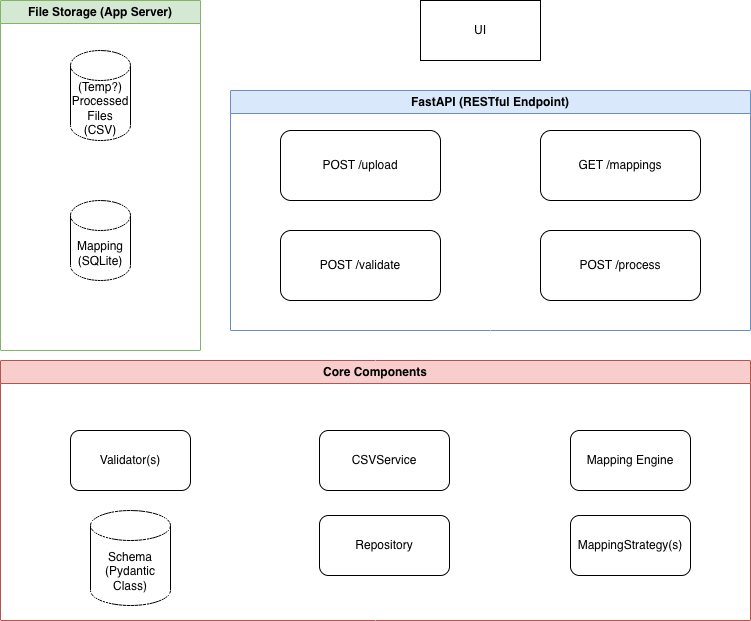

# column-mapper

## Getting Started

### Prerequisites
* Python 3.11

### Local Development & Setup
To install the package in editable mode with development and testing dependencies, run:

```bash
pip install -e ".[test]"
```

### Run unit and integration tests
```bash
pytest -v
```

### Run local server [from root]
```bash
fastapi dev app/main.py
```
Web UI should be available on http://127.0.0.1:8000/ui/index.html

## High-level Architecture


#### The app consists of:
- UI (HTML & Javascript)
- FastAPI server with following endpoints:
    - POST /upload: Allow user to upload a csv and optionally apply saved mapping, suggested mapping is returned (based on selected saved mapping + applied mapping strategy)
    - GET /mappings: List saved mappings
    - POST /validate: validate mapping covers required column and no NAs in required columns
    - POST /process: save mapping to data store (SQLite)
- Core components:
    - validators: contains validation logic, a list of validators are executed iteratively by FastAPI /validate endpoint
    - CSVService: Performs csv operations like saving, reading headers, reading whole file
    - MappingEngine: Carries out mapping sequence, apply guessed mapping (based on MappingStrategy) and saved mapping, returns a suggested mapping
    - Repository: Performs database operations